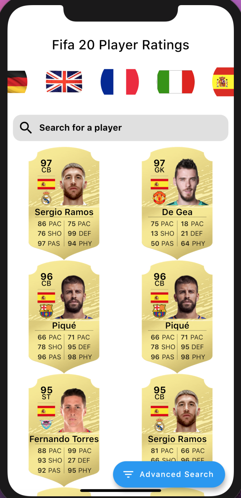

# Fifa Cards using Bloc and Flutter

## Built using Flutter, Bloc, RxDart, and FIFA 20 API.

<figure>

<figcaption> Loading state with data fetched from API</figcaption>
</figure>

<figure>

<figcaption> Searching State</figcaption>
</figure>

<figure>

<figcaption> Advanced search on API Data</figcaption>
</figure>

##### Built on top of Bloc Pattern tutorial by @techieblossom
